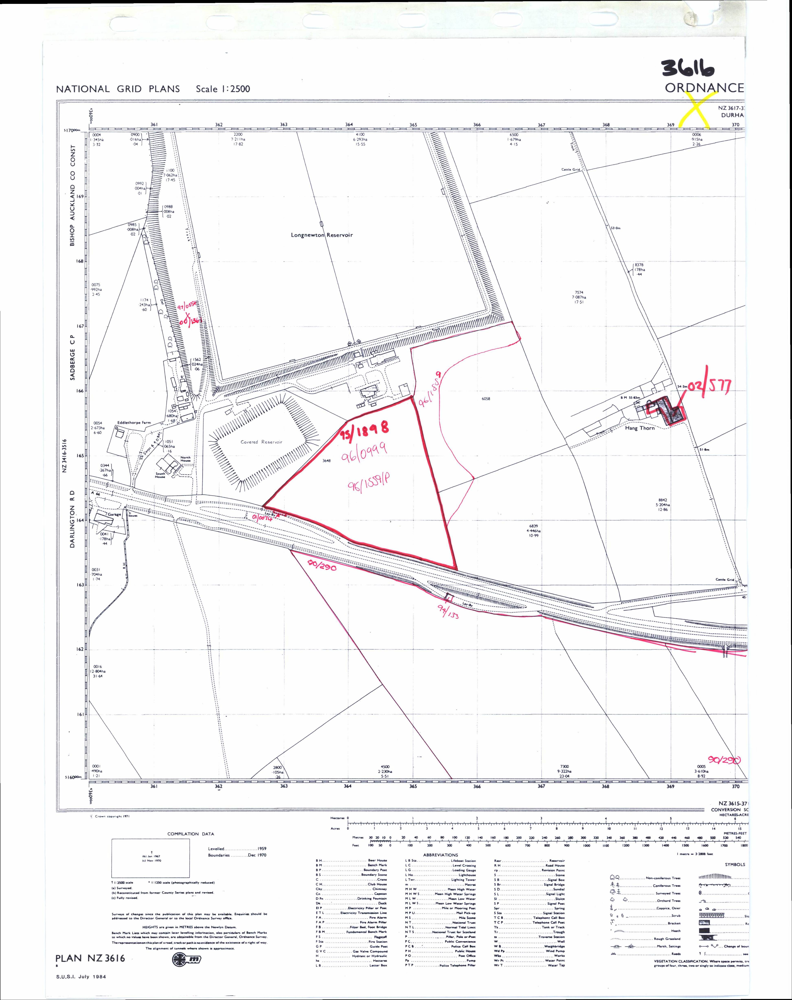

# HMLR-Vision: Deep Learning Segmentation Challenge
## Author: Augustine Osaigbevo

## Table of Contents

* [Project Description](#project-description)
* [Repository Structure](#repository-structure)
* [Instructions (How to Run)](#instructions-how-to-run)
* [Technical Approach](#technical-approach)
* [Results](#results)
* [Limitations & Challenges](#limitations--challenges)
* [Next Steps](#next-steps)

---

## Project Description

This project solves the problem of **automatically extracting red boundaries and red reference texts** from historical land registry plans using deep learning, as part of the HMLR Data Scientist Challenge. Accurate extraction of such features is critical for digitising and georeferencing legacy land records, enabling efficient property searches and automation.

**Relevance**:
* Land registry plans are often cluttered; only the red boundaries and reference texts define legal property extents.
* Automated, accurate extraction of these features saves significant manual effort and reduces errors in property registration.
* This approach aligns with HMLR's mission of digitising and modernising land records for efficiency and legal clarity.

---

## Repository Structure

```plaintext
data/
  ├─ stockton_1.png        # Original map image
  ├─ stockton_1.json       # VIA hand-labelled ground truth (red boundaries and text)
  ├─ mask_utils.py         # Helper functions for mask creation, rasterization, HSV post-processing
  ├─ stockton_1_mask.png   # Training mask (created in 01_explore_data)
src/
  ├─ data_loader.py        # Data loading utilities for UNet training
  ├─ unet_model.py         # U-Net building/training/inference functions
  ├─ geo_export.py         # GeoPackage export module
01_explore_data.ipynb      # Create mask from image + labels, visualise masks
02_train_model.ipynb       # Train U-Net on labelled mask
03_inference_export.ipynb  # Predict mask, OCR, geospatial export, visualisation
requirements.txt           # Python dependencies
```

---

## Instructions (How to Run)

1. **Install dependencies**

   On Databricks, run in a cell:

   ```python
   %pip install -r requirements.txt
   ```

2. **Prepare Data**

   Ensure you have these files in your `data/` directory:

   * [`data/stockton_1.png`](data/stockton_1.png) (original plan image)
   * [`data/stockton_1.json`](data/stockton_1.json) (hand labels)

3. **Create Training Mask**

   Run **`01_explore_data.ipynb`** to generate `data/stockton_1_mask.png`

   * Visualises red boundaries (HSV) and red texts (hand-labelled polygons).
   * Creates a 3-class mask (0: background, 1: boundary, 2: text).

4. **Train U-Net**

   Run **`02_train_model.ipynb`** to train a U-Net model using your mask.

   * Model weights will be saved to `checkpoints/unet_last.pt`.

5. **Predict, Post-process, and Export**

   Run **`03_inference_export.ipynb`**:

   * Predicts on the input image.
   * Filters boundary predictions using HSV “red” post-processing.
   * Applies OCR only to the predicted text regions.
   * Exports geospatial results (`output/segments.gpkg`).
   * Visualises the results.

---

## Technical Approach

**1. Labelling & Data Preparation:**

* All red boundaries (polylines) and red reference numbers (polygons) are manually labeled using [VGG Image Annotator (VIA)](http://www.robots.ox.ac.uk/~vgg/software/via/).
* Labels are stored in [`data/stockton_1.json`](data/stockton_1.json).
* A 3-class mask is generated:

  * `0`: Background (everything else)
  * `1`: Red boundary (lines)
  * `2`: Red text (reference numbers)

**2. Mask Utilities (src/mask_utils.py):**

* Contains helper functions for:
  * Rasterizing JSON polygons/polylines into binary masks
  * Creating the 3-class mask for training
  * Applying HSV-based filtering for red color as a post-processing step
* These utilities are used in 01_explore_data.ipynb and 03_inference_export.ipynb to streamline mask generation and improve prediction quality.

**3. Deep Learning Model:**

* [U-Net](https://arxiv.org/abs/1505.04597) (via [segmentation-models-pytorch](https://github.com/qubvel/segmentation_models.pytorch)) is trained **only on the hand-labeled mask**—no HSV pseudo-masks are used for training.
* Data augmentations (resize, flips, rotations, color jitter) applied for robustness.

**4. Post-processing:**

* After prediction, the “boundary” mask from U-Net is filtered by HSV “red” detection:

  * Only those predicted boundary pixels that are also “red” in HSV are retained as true boundaries.
* This removes non-red lines and keeps to the challenge requirement.

**5. Optical Character Recognition (OCR) Extraction:**

* [EasyOCR](https://github.com/JaidedAI/EasyOCR) is run **only on predicted text regions** (class 2) to extract red reference numbers.
* Only high-confidence, text-predicted areas are considered, reducing false positives.

**6. Geospatial Export:**

* Boundaries and text regions are exported as polygons to a [GeoPackage](https://www.geopackage.org/) (`output/segments.gpkg`) for use in GIS or further processing.

---

## Results

| Step                                   | Output Example                        |
| -------------------------------------- | --------------------------------------|
| Input (original map)                   |    |
| Mask creation (from 01\_explore\_data) |      |
| Inference: boundary, text, OCR         |  |

---

## Limitations & Challenges

| Challenge                                          | Approach/Mitigation                                                                                            |
| -------------------------------------------------- | -------------------------------------------------------------------------------------------------------------- |
| **Small labelled dataset**                          | Labeled all red boundaries/texts in full detail in the single image; used augmentation to help generalisation. |
| **Separating red boundaries from other map lines** | Trained U-Net with explicit labels; post-processed with HSV “red” filter to exclude non-red lines.             |
| **Text detection and OCR quality**                 | Used EasyOCR focused only on the predicted text regions; this reduces spurious OCR from background clutter.    |
| **Generalisability**                               | Solution is modular and can easily scale with more labelled data; recommends expansion in “Next Steps”.             |

> **Key insight:**
> *All learning is from hand-annotated masks. HSV is only used for filtering at inference time, not for model training. This ensures the workflow is a true deep learning solution with an additional color-based QC step.*

---

## Next Steps

* **Increase dataset size:** Label more maps to improve model generalisation and performance.
* **Refine post-processing:** Integrate advanced red-line detection, or learn “redness” as a feature.
* **Improve OCR pipeline:** Use model-predicted masks to crop and pre-process text for better OCR results.
* **Auto-evaluate:** Use synthetic masks or map overlays to assess boundary and text extraction quality.
* **Deploy as web app or API** for easy use in HMLR digitisation pipeline.

---

## Credits

* [VGG Image Annotator (VIA)](http://www.robots.ox.ac.uk/~vgg/software/via/)
* [segmentation-models-pytorch](https://github.com/qubvel/segmentation_models.pytorch)
* [EasyOCR](https://github.com/JaidedAI/EasyOCR)
* HMLR Challenge Data

---

*For questions, please contact: \[[augustine.osaigbevo@gmail.com](mailto:augustine.osaigbevo@gmail.com)]*