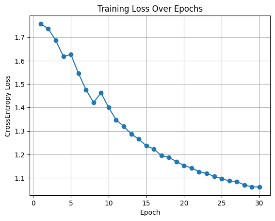
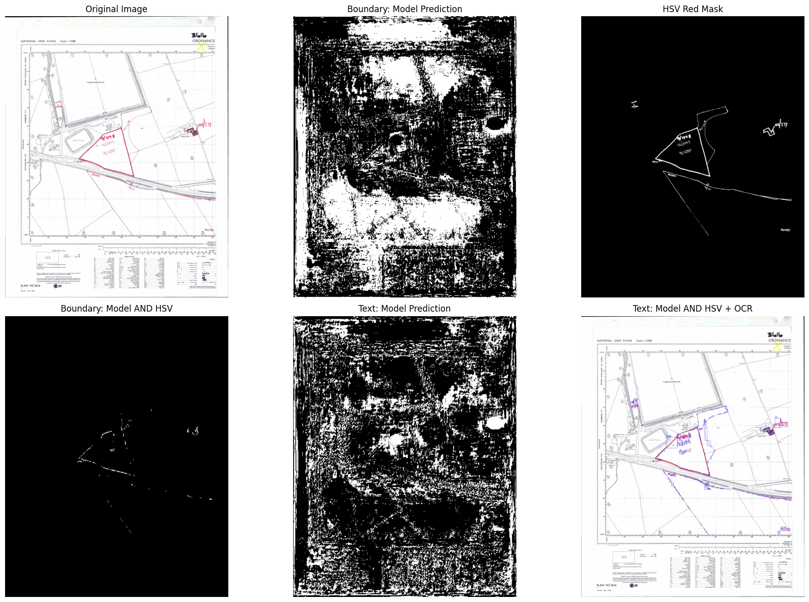

# HMLR-Vision: Deep Learning Segmentation Challenge

**Author:** Augustine Osaigbevo

---

## Table of Contents

* [Project Description](#project-description)
* [Repository Structure](#repository-structure)
* [Instructions (How to Run)](#instructions-how-to-run)
* [Technical Approach](#technical-approach)
* [Results & Performance](#results--performance)
* [Limitations & Challenges](#limitations--challenges)
* [Next Steps](#next-steps)
* [Credits](#credits)

---

## Project Description

This project addresses the problem of **automatically extracting red boundaries and red reference texts** from historical land registry plans using deep learning (U-Net). Efficient, accurate extraction is critical for digitising legacy land records and supporting modern GIS workflows.

### Relevance:

* Only red boundaries and red reference numbers define property extents on historical plans.
* Manual digitisation is slow and error-prone; automation supports the HMLR's mission to digitise the land register.

---

## Repository Structure

```
data/
  ├─ stockton_1.png        # Original map image
  ├─ stockton_1.json       # VIA hand-labelled ground truth (red boundaries and text)
  ├─ stockton_1_mask.png   # Training mask (created in 01_explore_data)
output/
  ├─ training_loss.png     # Training loss plot (see Results)
  ├─ result.png            # Inference result (see Results)
  ├─ segments.gpkg         # Geopackage result
src/
  ├─ data_loader.py        # Data loading utilities for U-Net
  ├─ unet_model.py         # U-Net model build/train/inference functions
  ├─ mask_utils.py         # Mask creation, rasterization, HSV red filtering
  ├─ geo_export.py         # GeoPackage/shapefile export
01_explore_data.ipynb      # Visualise data, create masks from labels
02_train_model.ipynb       # Train U-Net, plot/track training loss
03_inference_export.ipynb  # Predict, post-process, OCR, export results
requirements.txt           # Python dependencies
```

---

## Instructions (How to Run)

### 1. **Install dependencies**

```python
%pip install -r requirements.txt
```

### 2. **Prepare Data**

Make sure you have:

* [`data/stockton_1.png`](data/stockton_1.png) (original plan)
* [`data/stockton_1.json`](data/stockton_1.json) (labels)

### 3. **Create Training Mask**

Run [`01_explore_data.ipynb`](01_explore_data.ipynb) to generate:

* [`data/stockton_1_mask.png`](data/stockton_1_mask.png)
* Visualises red boundaries (HSV) and red texts (hand-labelled polygons).

### 4. **Train the Model**

Run [`02_train_model.ipynb`](02_train_model.ipynb):

* Trains U-Net (3 classes: background, red boundary, red text).
* Model is trained on hand-labelled masks only.
* Loss curve is saved as [`output/training_loss.png`](output/training_loss.png).

### 5. **Inference, Post-process, Export**

Run [`03_inference_export.ipynb`](03_inference_export.ipynb):

* Predicts boundaries/texts on input image.
* **Post-processes boundaries:** Retain only predictions that are red (HSV filter).
* **OCR:** Only on predicted text regions.
* Exports results to geopackage/shapefile and visualises them.

---

## Technical Approach

### 1. **Labelling & Data Preparation**

* Red boundaries (as polylines) and red texts (as polygons) are labelled in [VIA](http://www.robots.ox.ac.uk/~vgg/software/via/).
* Mask is 0 (background), 1 (boundary), 2 (text).

### 2. **Mask Utilities ([src/mask\_utils.py](src/mask_utils.py))**

* `rasterize_json`: Converts VIA JSON to mask, drawing polylines as boundaries and polygons as text.
* `hsv_red_mask`: Returns binary mask of “red” regions (HSV thresholding).
* **Purpose:**

  * Streamline mask creation for training
  * Provide post-processing (filter U-Net predictions to *only* “red” regions at inference, improving accuracy).

### 3. **Model Training ([src/unet\_model.py](src/unet_model.py))**

* **Model:** U-Net (from `segmentation-models-pytorch`), trained from scratch.
* **Augmentations:** Resize, flip (no color jitter/rotation for best convergence).
* **Loss:** Categorical Cross-Entropy.
* **Monitoring:** Training loss per epoch, plotted and saved.

### 4. **Inference & Post-Processing**

* Model predicts mask (boundary/text/background).
* *Boundary predictions are combined with the HSV red mask* — ensures only actual red lines are output as boundaries.
* *Text mask is used for OCR (EasyOCR) extraction.*

### 5. **Export**

* Outputs geospatial polygons and OCR text to `output/segments.gpkg`.

---

## Results & Performance

### **Sample Outputs**

| Step                | Example Output                             |
| ------------------- | ------------------------------------------ |
| Training mask       |                 |
| Training loss curve |  |
| Inference result    |                |

### **Training Loss (CrossEntropy)**

* Loss decreases steadily over 30 epochs.
* Shows consistent convergence, indicating successful learning even from a single, well-labelled image.
* Indicates that the model is learning to distinguish red boundary/text from background.

### Performance Summary
The U-Net model, even with a single annotated map, effectively segments the main red boundaries and text regions when combined with HSV filtering and targeted OCR. While some very fine text or faded lines may be under-segmented, the approach minimises false positives and aligns well with manual labels, as shown in the “Inference result”. The training loss plot demonstrates consistent improvement and no sign of overfitting.

---

## Challenges & Mitigations

| Challenge                           | Approach/Mitigation                                                           |
| ----------------------------------- | ----------------------------------------------------------------------------- |
| **Small labelled dataset**          | Manually labelled all boundaries/texts in detail; used strong augmentations   |
| **Non-red boundaries/texts in map** | U-Net trained *only* on labelled reds; HSV filter at inference keeps only red |
| **Text detection/OCR errors**       | OCR restricted to predicted text regions (reduces false positives)            |
| **No real validation set**          | Used training loss as proxy metric, due to data limitation                    |

> **Key Note:**
> No HSV pseudo-masks are used for training.
> All model learning is from hand labels. HSV is used **only** for post-processing at inference, ensuring the deep learning solution is “supervised” and robust.

---

## Next Steps

* Label additional images to enable proper validation/testing and further improve accuracy.
* Refine the post-processing pipeline (e.g., advanced morphological ops, shape heuristics).
* Use model predictions to crop/pre-process text for improved OCR accuracy.
* Develop evaluation metrics (IoU, Precision/Recall) as more data is labelled.
* Package into a web app or REST API for HMLR workflow integration.

---

## Credits

* [VGG Image Annotator (VIA)](http://www.robots.ox.ac.uk/~vgg/software/via/)
* [segmentation-models-pytorch](https://github.com/qubvel/segmentation_models.pytorch)
* [EasyOCR](https://github.com/JaidedAI/EasyOCR)
* HMLR Data Science Challenge

---

*Contact: [augustine.osaigbevo@gmail.com](mailto:augustine.osaigbevo@gmail.com)*
